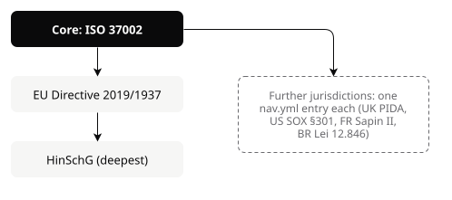
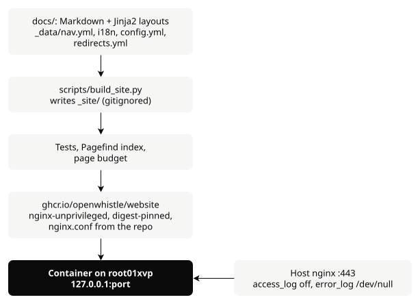
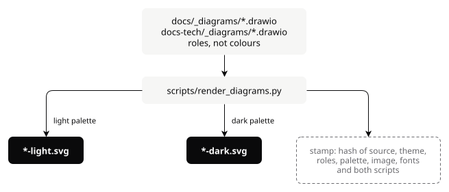
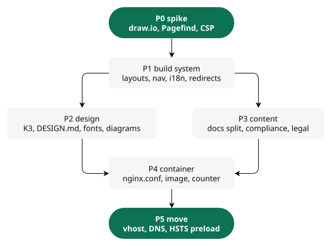

# openwhistle.net redesign: design

Type: explanation + scope. Source: the brainstorming session of 2026-10-01. Covers the website, the blog and
the user documentation. Every decision below was taken with the maintainer; the "Why" column is the reason
that has to survive the next rewrite.

## Positioning

| | |
| --- | --- |
| Goal | The default open-source tool for legally required internal reporting channels. Deepest for Germany (HinSchG), law-agnostic core for everyone else. |
| USP 1 | Anonymity you can verify instead of trust: no IP at any layer, reporter times as the day only, metadata stripped from attachments. Against SaaS vendors whose answer is "trust us". |
| USP 2 | Built for the corporate internal channel (deadlines, 4-eyes deletion, audit log, roles, locations), not for journalism. Against GlobaLeaks and SecureDrop. |
| USP 3 | Free and under your own control: data never leaves your infrastructure, no licence, no vendor. |
| Weakness, shown openly | One maintainer, no external audit. The site says so and says how to help close it (`contribute/`). |

The law is a profile, not the foundation:

<picture>
  <source media="(prefers-color-scheme: dark)" srcset="../img/diagrams/law-profiles-dark.svg">
  
</picture>

What the product is and why it is trustworthy is written law-agnostic. Each jurisdiction page states concretely
what the software covers and what it does not. No page gives legal advice.

## Decisions

| # | Decision | Why |
| --- | --- | --- |
| D1 | Operator: the maintainer's Kleinunternehmen; imprint with the c/o address of Impressum-Privatschutz | The home address is the business address; a whistleblowing project should not publish it |
| D2 | Hosting: own container on root01xvp next to the demo, behind the host nginx; TLS from the existing DNS-01 certificate (`openwhistle.net` + `*.openwhistle.net`) | GitHub Pages sets no security headers and logs visitor IPs outside our control |
| D3 | Build: Python + Jinja2 + `markdown-it-py`; plain HTML out | Smallest new attack surface (two packages), hash-locked in `uv.lock`, seen by Dependabot and Renovate. A Hugo binary is invisible to dependency scanning |
| D4 | No third-party code at runtime: no CDN, no npm in the browser, no external request | The visitor of a whistleblowing site must not be logged or fingerprinted by anyone |
| D5 | No analytics product. Search Console plus an IP-less page counter | Matomo would have needed IP handling on a shared host; "we store no IP addresses" stays a true sentence |
| D6 | No cookie banner | No cookies, no tracking; the theme in `localStorage` is user-requested (§ 25 (2) TDDDG) |
| D7 | Languages: English and German, both complete and strong; language is data, not a hard-coded pair | A third language must be config + translations, never a template change |
| D8 | Documentation in English only | Admins read English; every setting change would otherwise be kept in sync twice |
| D9 | Imprint once, in German, at `/impressum/`; privacy policy in both languages | § 5 DDG names no language; Art. 12 GDPR asks for "clear and plain language" for the reader |
| D10 | Logo: speech bubble with keyhole (variant K3), single colour ink | The shield fails at 16 px and breaks "one accent per screen"; ink keeps the emerald for the action |
| D11 | Diagrams: draw.io sources, exported to light and dark SVG | Better legibility and colour than Mermaid; the pipeline is the template for easywall |
| D12 | Signal design system stays; DESIGN.md gains the rules listed under "Design" | The redesign is structure and engineering, not a new brand |
| D13 | No telephone number in the imprint | Maintainer's decision. Residual risk: after CJEU C-649/17 e-mail alone may not count as a second rapid channel |

## Architecture and deploy

<picture>
  <source media="(prefers-color-scheme: dark)" srcset="../img/diagrams/site-architecture-dark.svg">
  
</picture>

- `docs/` stays the published directory; it now holds sources. Directories starting with `_` never reach the
  output. `docs-tech/` is never published; `test_the_technical_docs_are_not_published` keeps holding that.
- Headers are set by the container's `nginx.conf` (in this repo, tested). The host vhost proxies only, logs
  nothing and must block the four inherited host-level headers, or HSTS and X-Frame-Options arrive twice.
- Deploy: a push to `main` builds and pushes the image; wdk-ansible pins its digest, Renovate there opens a pull
  request for each new digest, and its merge rolls it out (as for energysharing). No token leaves GitHub: Semaphore is
  LAN-only (corrected 2026-10-09, see `2026-10-09-website-p4-design.md` § Handed to P5).
- The website is not part of `playbooks/linux/openwhistle/demo.yml`, which removes its containers every 6 h.

### Constraints owned by wdk-ansible

| Constraint | Source |
| --- | --- |
| Container as `host_specific/tasks/<app>.yml` (pattern `momo.yml`), loopback port, tag pin in `docker_images.yml`, entry in `hc_expected_images` | wdk-ansible deploy pattern |
| :443 vhost `openwhistle.net www.openwhistle.net` with server-level `access_log off;` and `error_log /dev/null;`, deployed and verified **before** DNS moves | Otherwise requests hit the :443 default server, which logs IPs |
| DNS: apex A `116.203.101.177`, AAAA `2a01:4f8:c2c:6e34::1`, and `www` in `dns.yml`; GitHub Pages A records `185.199.108-111.153` deleted with `scripts/nicmanager-api.sh del` in the same step | `dns.yml` never deletes |
| Confirm `mta-sts`, `autoconfig`, `autodiscover` serve HTTPS before the apex HSTS preload submission | `includeSubDomains; preload` covers every subdomain |
| Search Console verified by DNS TXT in `dns.yml` | Survives the hosting move |

## Site structure

```text
/                         302 by Accept-Language → /en/ or /de/ (x-default), no cookie
/en/ ↔ /de/               home
  compliance/             overview: ISO 37002 core, what OpenWhistle covers
    eu-directive/         ↔ /de/compliance/eu-richtlinie/
    hinschg/              ↔ /de/compliance/hinschg/
  security/               ↔ /de/sicherheit/      why trust it; open gaps; how to report a vulnerability
  contribute/             ↔ /de/mitmachen/       where reviews help most, first issues, translations, sponsoring
  compare/                ↔ /de/vergleich/       open-source comparison
  blog/<slug>/            ↔ /de/blog/<deutscher-slug>/, plus feed.xml per language (Atom)
  privacy/                ↔ /de/datenschutz/
/en/docs/                 English only
/en/changelog/  /en/roadmap/
/impressum/               German, linked from every footer ("Legal notice (Impressum)" on English pages)
/.well-known/security.txt
404                       one bilingual page
```

Google determines language from visible content only, not from the URL or `lang`; prefixes and German slugs
are for readers and maintenance. Every old URL gets a 301 from `docs/_data/redirects.yml`.

- Navigation: Compliance · Security · Docs · Blog, language switch, one emerald button "Try the demo".
- Footer: Impressum · Privacy · security.txt · GitHub · Sponsor · Contribute.
- Home, in order: one-sentence statement; the emerald block with the three promises; reporting flow as a
  draw.io diagram; core features; compliance by jurisdiction; "verify it" with the open gap and a link to
  `contribute/`; demo or install.

## Legal pages

Imprint text, as delivered by the provider (telephone line removed, editorial address added):

```text
Impressum

Inhalte gemäß § 5 DDG

[name]
[c/o]
Ludwig-Erhard-Straße 18
20459 Hamburg

Kontaktdaten:
E-Mail: info@openwhistle.net

Redaktionell verantwortlich (§ 18 Abs. 2 MStV):
[name]
[c/o]
Ludwig-Erhard-Straße 18
20459 Hamburg

Quelle: Impressum-Privatschutz
```

Provider legal texts are copied as static text, never embedded by script or iframe. The privacy policy states
exactly this setup and nothing else: own server, no IP in any log, the page counter's four fields, no cookies,
no analytics, self-hosted fonts, theme in `localStorage`. Generator boilerplate for analytics or cookies is
removed. The English version is a translation of the German one.

## Security, performance, accessibility

Container headers:

```text
Content-Security-Policy: default-src 'none'; script-src 'self' 'sha256-<theme-toggle>'; style-src 'self'
  'sha256-<critical-css>'; img-src 'self'; font-src 'self'; connect-src 'self'; base-uri 'none';
  form-action 'none'; frame-ancestors 'none'; upgrade-insecure-requests
  (docs pages only: script-src adds 'wasm-unsafe-eval' for Pagefind)
Strict-Transport-Security: max-age=63072000; includeSubDomains; preload
Cross-Origin-Opener-Policy: same-origin     Cross-Origin-Resource-Policy: same-origin
Referrer-Policy: no-referrer                X-Content-Type-Options: nosniff
Permissions-Policy: camera=(), microphone=(), geolocation=(), interest-cohort=()
```

| Area | Rule |
| --- | --- |
| Page budget | First view ≤ 100 KB transferred, LCP < 1.5 s and CLS 0 under mobile throttling (Playwright + CDP), zero requests to another host. A test per built page; no Lighthouse, no npm |
| Fonts | Subset once with fonttools to the used glyphs, committed as woff2; preload only the cuts in use |
| Images | AVIF and WebP with `srcset` from Pillow at build; `width`/`height` always; `loading="lazy"` below the fold |
| Compression | `.gz` written at build, served by `gzip_static`. No Brotli: stock nginx lacks it, gain about 15 % on small pages |
| Runtime JS | Inline theme toggle; copy button and search loaded on demand |
| Accessibility | WCAG 2.2 AA. Skip link, landmarks, `lang` per page, `:focus-visible`, contrast as tokens. axe-core vendored with a SHA-256 check (fixes the unverified jsDelivr download in `tests/e2e/conftest.py:59`), run on every page, both themes, 390 and 1920 px |
| Page counter | `log_format` of the container nginx: time, path, status, referrer host. No IP, no user agent. `scripts/site_stats.py` aggregates from journald on demand |

## Documentation

The single page `docs/docs.html` (162 KB) is split by reader type. Content is moved, not rewritten:

| Section | Pages |
| --- | --- |
| Get started | Requirements · Install with Docker Compose (steps 1–4 and the setup wizard) · Your first report |
| How-to | Kubernetes · TLS proxy · SELinux · onion address · LDAP/AD · OIDC · S3 · ClamAV · notifications · retention · multi-tenancy · upgrade and rollback · rotate the encryption key · lost authenticator · demo mode |
| Guides by role | Admin: reports, roles and users, audit log, categories and locations, statistics, deadlines, telephone channel. Whistleblower: submit, check status, stay safe |
| Reference | Configuration · images, tags and signatures · roles and permissions · status workflow · limits and file types · security headers |
| Explanation | Four anonymity layers · rate limiting without IPs · what leaves the host · what is stored about time · onion trust boundary · Redis sizing · counting installations |
| Project | Changelog (rendered from `CHANGELOG.md`) · roadmap |

- Configuration reference is built from `docs/_data/config.yml`; `tests/test_config_documented.py` checks both
  directions against `Settings`.
- From easywall: navigation in one data file with a test in both directions, groups as `<details>`, Pagefind
  search (`/` key, `<dialog>`, a highlight term; P3 carries it as `#highlight=`, a fragment the server never
  sees, not easywall's `?highlight=`), copy buttons, prose gate, heading-ID test.
- Different from easywall: Pagefind from PyPI (`pagefind`, hash-locked) instead of `npx`; own small UI on
  `pagefind.js` instead of `pagefind-ui` (120 KB); "on this page" built at build time, not by JS. Added: skip
  link, 404, previous/next, "Edit on GitHub".
- P0 (2026-10-02): `pagefind` 1.5.2 from PyPI (`python -m pagefind`) searches under the docs CSP with no violation, so
  no further directive is needed; with WASM blocked Chromium throws a CompileError and fires no
  `securitypolicyviolation` event.

### Diagrams

<picture>
  <source media="(prefers-color-scheme: dark)" srcset="../img/diagrams/diagram-pipeline-dark.svg">
  
</picture>

- Export with the draw.io CLI in a digest-pinned container; SVGs are committed, so CI needs no draw.io and a
  test checks the stamp.
- The page shows the variant matching `data-theme` (two ``), not a media query, which would
  disagree with the theme toggle.
- Redrawn: architecture, submission flow, case lifecycle, admin login, plus the home-page flow.
- P0 (2026-10-02): with `html=0` and no `whiteSpace=wrap` (it forces `foreignObject`; break lines by hand) the export
  yields `<text>`, no `foreignObject`; Sora is not embedded, so `render_diagrams.py` injects a fonttools subset as a
  `data:font/woff2` `@font-face` (1568 bytes for the probe; verified in an ``; needs `brotli` in the `site` group).
  CLI image pinned at `rlespinasse/drawio-desktop-headless@sha256:49018905afd4a309bacdab351982965c9d970536c5091bef98efa5725a76f2c9`.

## SEO and blog

| Element | Built from | Test |
| --- | --- | --- |
| Title ≤ 60 characters, description 120–160, unique | front matter | length and uniqueness across the site |
| canonical, hreflang | `translation_key` pairs EN and DE | reciprocal; every target exists |
| OG image per page | Pillow, 1200×630, Signal ground, title, mark | exists, right size |
| JSON-LD | home: `SoftwareApplication` + `Organization`; blog: `BlogPosting` (author, `datePublished`, `dateModified`); docs: `BreadcrumbList` | valid JSON, required fields |
| Sitemap | every page with `xhtml:link` alternates; `lastmod` from the source file's last commit | every page listed, none 404 |
| Feeds | `/en/blog/feed.xml`, `/de/blog/feed.xml` | valid Atom |
| Redirects | `docs/_data/redirects.yml` → nginx map | every URL of today's sitemap (22) reaches an existing page |

- Every article in English and German, German slug, summary first, links to docs or compliance at the end.
  No tags or categories at eight articles.
- Internal links resolve at build or the build fails. External links: weekly workflow that opens an issue.
- Topics come from releases and findings (blog, not Ko-fi). Sponsoring: GitHub Sponsors (via the business).

## Design

- Logo K3: one SVG source for site and app, one geometry (test as easywall's `TestTheMarkHasOneGeometry`).
  Replaces the shield in `app/templates/base.html` (inline SVG) and `app/static/favicon.svg`, which is
  byte-identical to `docs/favicon.svg`. `brand.logo_url` for operator branding is kept.
- DESIGN.md § Brand is rewritten: it describes an emerald "wax seal" square that was never built.
- Rules added to DESIGN.md: `text-wrap: balance` on headings; `tabular-nums` for figures; `translate="no"` on the
  brand name and code; borders as shadows; concentric radii; never `transition: all`; prose ≤ ~70 characters;
  persistent docs sidebar on desktop with search on top; at most three nav levels; icons always with a text
  label; copy: active voice, specific button labels, errors that name the way out.

## Guards

Every new guard goes through `scripts/mutation_audit.py` and must go RED.

| Guard | Holds |
| --- | --- |
| Every page in `nav.yml` and back; hreflang reciprocal; every old URL redirected | structure, SEO |
| CSP hashes match the inline scripts; no request to another host; axe clean | security, accessibility |
| Page budget per page | performance |
| Diagram stamp current; one logo geometry | assets |
| No placeholder in the imprint; privacy policy names exactly the setup; no IP field in `log_format` | legal, privacy |

The 15 test files that read `docs/docs.html` move to the built site. Updated in the same work: `CONTRIBUTING.md`
§ Documentation (prose-rule file list, "Diagrams are Mermaid"), the sync rule in `CLAUDE.md`, `README.md`,
`docs-tech/seo-marketing.md`; `.superpowers/` into `.gitignore`.

## Delivery

One PR per phase. The old site stays on GitHub Pages until P5.

<picture>
  <source media="(prefers-color-scheme: dark)" srcset="../img/diagrams/delivery-dark.svg">
  
</picture>

Before P5: Chrome check of every page at Full HD (`docs-tech/local-review.md`), zero open code-scanning alerts in
the whole repository, mutation audit.
